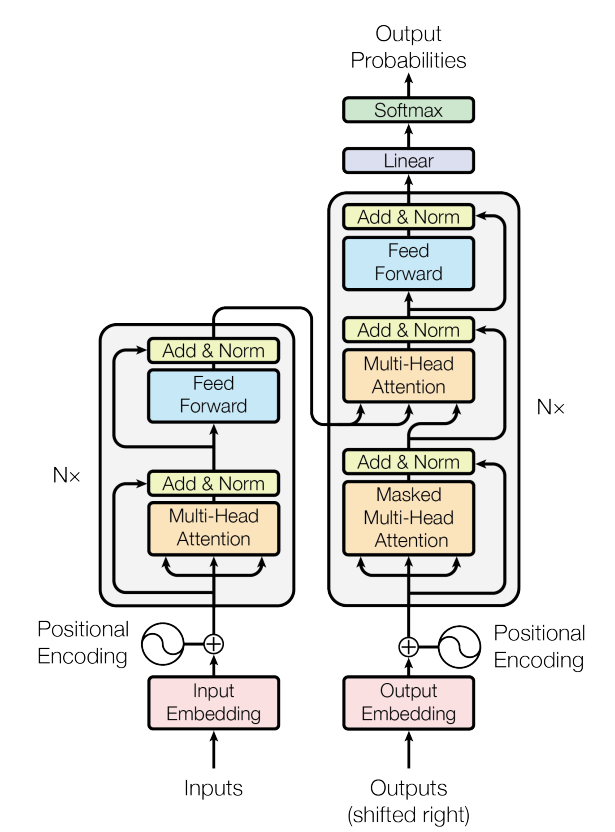

# Implementación de un Transformer desde cero
Una implementación en PyTorch del modelo base de transformer propuesto en [Attention Is All You Need](https://arxiv.org/abs/1706.03762).

## Descripción general de la arquitectura

